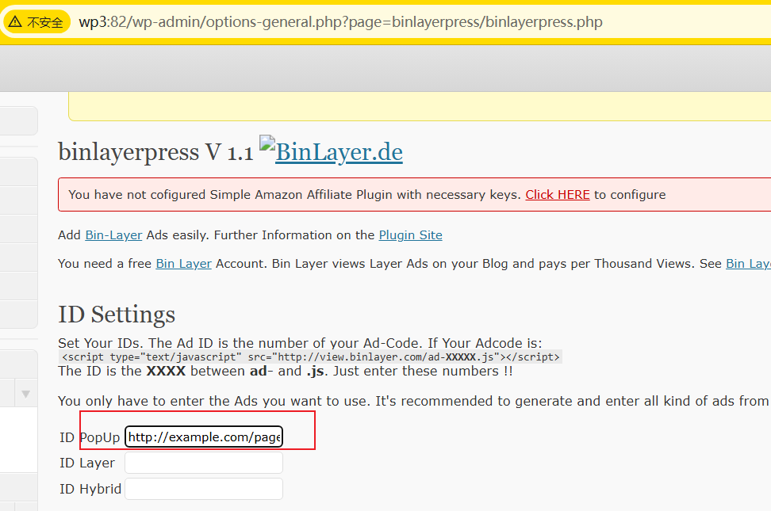

### The data addition interface of the wordpress plug-in BlogBuzzTime has an XSS vulnerability

**Official website**: https://wordpress.org/plugins/binlayerpress/

**Version**：1.1

**Route**：/wp-admin/options-general.php?page=binlayerpress/binlayerpress.php

**API function**: data addition

**Injection parameters**: binlayerpress[code_pop]

**Request method**：POST

#### 1.Vulnerability analysis

In the binlayerpress.php page, it is found that the binlayerpress[code_pop] parameter passed in by post method is not filtered, and the variable will be registered for persistent storage.

When the user visits the page, the previously injected binlayerpress[code_pop] will be displayed on the page.

The attacker can construct an xss payload to implement a storage-type XSS attack, so that every user who visits the page will be affected by the vulnerability.


#### 2.Vulnerability verification and exploitation

We can construct the following payload in the ID PopUp position and insert it:

```
http://example.com/page.php"><script>alert(123);</script>
```

It is found that a pop-up window will be displayed when data is passed to the backend. The attack is successful.




